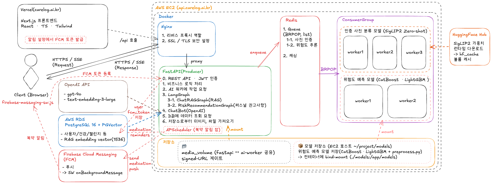

<div align="center">


# 케어로그 · CareLog

### 만성질환 생활습관 챌린지 웹 서비스

**"매일의 케어, 건강의 기록."**

고혈압 · 당뇨 · 이상지질혈증 발병 위험을 예측하고, 생활습관 개선을 돕는 AI 기반 통합 헬스케어 플랫폼

[](https://carelog.ai.kr/)


🔗 **배포 URL**: https://carelog.ai.kr/

</div>

---

## 📑 목차

1. [프로젝트 개요](#1-프로젝트-개요-)
2. [핵심 기능](#2-핵심-기능-)
3. [기술 스택](#3-기술-스택-)
4. [시스템 아키텍처](#4-시스템-아키텍처-)
5. [구현 하이라이트 — 어떻게 만들었나](#5-구현-하이라이트--어떻게-만들었나-)
6. [프로젝트 구조](#6-프로젝트-구조-)
7. [설치 및 실행](#7-설치-및-실행-)
8. [테스트 및 품질 관리](#8-테스트-및-품질-관리-)
9. [개발 가이드](#9-개발-가이드-)
10. [팀](#10-팀-)

---

## 1. 프로젝트 개요 📝

만성질환은 식습관·운동·수면 등 **생활습관과 밀접하게 연결**되어 있지만, 기존 건강관리 앱은 기록 중심이라 지속적인 참여를 끌어내는 데 한계가 있었습니다.

**케어로그**는 사용자가 쉽게 입력할 수 있는 생활습관 정보만으로 만성질환 발병 위험을 예측하고, 그 결과를 토대로 **예측 → 추적 → 챌린지**로 이어지는 자기관리 루프를 완성하는 것을 목표로 합니다.

> ⚠️ 본 서비스의 위험도 예측·건강 정보는 **의학적 진단이 아니며**, 정확한 진단·치료는 의료 전문가에게 문의해야 합니다. 모든 위험도/가이드 화면에 면책 고지를 노출합니다.

---

## 2. 핵심 기능 ⚒️

| 기능 | 설명 | 구현 방식 |
|---|---|---|
| 🔐 **인증** | 회원가입/로그인, 카카오 소셜 로그인 | JWT(Access+Refresh) · bcrypt 해싱 · Redis 블랙리스트 로그아웃 · 5회 실패 잠금 |
| 📊 **만성질환 위험도 예측** | 고혈압·당뇨·이상지질혈증 발병 위험 | KNHANES 기반 CatBoost+LightGBM 성별 분리 모델 · SHAP Top5 기여인자 · 0~100점 |
| 📈 **건강 추적 대시보드** | 건강·행동 데이터 시각화, 예측 결과 변화 추적 | 7단계 멀티스텝 입력 폼 · 진료지침 기반 상태 판정 · 추이 그래프 · 월간 리포트(PDF) |
| 💬 **AI 챗봇 (RAG)** | 의료 지식 기반 건강 상담 | LangGraph: Prefilter → 하이브리드 검색 → 2단계 품질평가 · SSE 실시간 스트리밍 |
| 📷 **챌린지 사진 인증** | 사진으로 챌린지 인증 자동 검증 | SigLIP2 Zero-shot 분류 · Redis 큐로 비동기 처리 |
| 🏃 **생활습관 챌린지** | 개인·그룹 챌린지, 출석·퀴즈 | 8개 카테고리 · 사진형/체크형 인증 · 포인트 보상 |
| 🐾 **커뮤니티 & 펫** | 정보 공유 게시판, 펫 키우기 | 게시글/댓글/좋아요/리더보드 · 포인트·경험치 게이미피케이션 |
| 🔔 **알림** | 복약·챌린지·커뮤니티 알림 | FCM(Firebase Cloud Messaging) 웹 푸시 |

---

## 3. 기술 스택 🛠️

| 구분 | 기술 |
|---|---|
| **Backend** | Python 3.13, FastAPI (async), Tortoise ORM, UV 패키지 매니저 |
| **Database** | PostgreSQL 16 + PGVector (RAG 임베딩), Redis (큐·캐싱·블랙리스트) |
| **AI / ML** | PyTorch, scikit-learn, CatBoost, LightGBM, SHAP, Optuna |
| **LLM / RAG** | LangGraph, OpenAI GPT-4o / 4o-mini, text-embedding-3, BM25 + Kiwi(형태소) 하이브리드 검색 |
| **Vision** | SigLIP2 (Zero-shot 챌린지 사진 인증) |
| **Frontend** | Next.js, React, TypeScript |
| **Infra / DevOps** | Docker Compose, Nginx (Reverse Proxy), AWS EC2 + RDS, Certbot(HTTPS), GitHub Actions(CI) |

### 기술 선택 근거

- **FastAPI(async)** — I/O 다중 처리에 유리해 동기 프레임워크 대비 동시성 우위.
- **Redis 큐 + 워커 분리** — 무거운 ML 추론을 API 서버와 디커플링하여 응답성 확보.
- **RAG vs 파인튜닝** — 수십억 파라미터 재학습 대신 진료지침을 실시간 주입(저비용·고신뢰).
- **PostgreSQL + PGVector** — 관계형 데이터와 벡터 검색을 단일 DB에서 운영.

---

## 4. 시스템 아키텍처 🏗️



- **Client (Next.js)** → **Nginx** → **FastAPI** 구조. Nginx가 `:80/:443`에서 리버스 프록시.
- **FastAPI(Producer)** 는 무거운 ML 작업을 **Redis 큐**에 적재하고, **ai-worker / risk-worker(Consumer)** 가 BRPOP 폴링으로 비동기 처리 → 결과를 DB에 기록.
- **AWS RDS (PostgreSQL + PGVector)** — 비즈니스 데이터와 RAG 임베딩을 함께 저장.
- **FCM** — 백그라운드 알림 푸시.

### LangGraph 오케스트레이션

RAG 챗봇(1단계)과 위험도 권고(2단계)는 LangGraph 상태 그래프로 구현되며, 의료 가드(`R1~R5` 규칙 + LLM 6기준)를 양 그래프가 공용으로 사용합니다.


---

## 5. 구현 하이라이트 — 어떻게 만들었나 🔬

### 5.1 만성질환 위험도 예측 모델

- **데이터셋**: 국민건강영양조사(KNHANES) 9차 2022–2024 — 원본 6,997행 → 최종 학습 5,275행.
- **전처리**: 가족력 3컬럼 통합(있음/없음/모름), 취침·기상 시각에서 수면시간 역산, 결측·이상치 처리.
- **프록시 파생변수**: 혈액검사 없이도 생활습관만으로 추정 — 예) **HbA1c 추정**(공복혈당 + 생활습관 16개 변수 가중합, 혈당 구간별 가중치 조정).
- **모델**: CatBoost + LightGBM **성별 분리 학습** → SHAP(15 features) → Optuna 50회 HPO → OOF 5-fold CV.
- **점수화**: AHA 가중치 기반 `risk_prob` 계산 후, bimodal 분포 문제를 `P(질환있음)` 혼합으로 보정 → KDE 백분위로 0~100점 변환.
- **검증**: 전 질환 well-calibrated (ECE 0.03~0.07).
- **입력**: 남성 25개 / 여성 27개 항목, **출력**: 고혈압(4단계)·당뇨(3단계)·이상지질혈증(2단계) + SHAP 기여요인.

### 5.2 RAG 챗봇 (LangGraph)

- **① Heuristic Prefilter** — GPT 호출 전 규칙 기반 필터(서비스 질문·짧은 인사는 즉시 응답).
- **② N1~N4 / R1~R5 Guard** — GPT 오분류·위험 답변을 강제 교정하는 의료 안전장치.
- **③ 2단계 품질 평가** — 규칙 검사(R1~R5) 후 GPT 6기준(근거 충실성·안전성·개인화·어조·완결성·환각) 평가 → 실패 시 최대 2회 재시도.
- **④ 하이브리드 검색** — 벡터(text-embedding-3, 1536차원) + BM25(Kiwi 형태소) 결합.
- **SSE 실시간 스트리밍** — `meta → stage → token → done` 이벤트로 단계 라벨과 LLM 토큰을 실시간 전송.

### 5.3 챌린지 사진 인증 (Zero-shot CV)

- **모델**: `google/siglip2-base-patch16-224` (Apache 2.0, 상업 사용 가능).
- **Zero-shot 분류** — 별도 학습 없이 `"물 마시는 사진"` 같은 텍스트 프롬프트만으로 판별.
- **Positive vs Negative 대결 구조** — `positive_max ≥ threshold AND positive_max > negative_max + 0.05` 조건으로 오인증 방지.

---

## 6. 프로젝트 구조 📂

두 개의 Python 서비스가 하나의 저장소·`pyproject.toml`을 공유합니다.

```text
.
├── app/                # FastAPI HTTP 서버 (인증, 사용자, 비즈니스 로직)
│   ├── apis/v1/        # 라우터 (v1 버전 관리, __init__.py 에 등록)
│   ├── services/       # 비즈니스 로직
│   ├── repositories/   # DB 접근 (Tortoise 모델)
│   ├── models/         # Tortoise ORM 모델
│   ├── dtos/           # Pydantic 요청/응답 스키마
│   ├── dependencies/   # FastAPI Depends 제공자 (인증 등)
│   ├── graphs/         # LangGraph 상태 그래프 (RAG · 위험도 권고)
│   ├── core/           # 설정, DB, JWT, 유틸 등 공통 기능
│   └── main.py         # FastAPI 진입점 (docs: /api/docs)
├── ai_worker/          # ML 추론/학습 워커 (Redis 큐 소비)
│   ├── main.py         # 챌린지 사진 인증 워커 (SigLIP2, 가동 중)
│   └── risk_inference/ # 위험도 예측 워커
├── migrations/models/  # aerich 마이그레이션
├── infra/              # 운영 인프라 (docker/ · nginx/)
├── scripts/            # 배포·CI 쉘 스크립트
├── docs/               # 기획 산출물 · 아키텍처 · 이미지
├── web/                # Next.js 프론트엔드
├── docker-compose.yml  # 로컬 개발용 전체 스택
└── pyproject.toml      # uv 기반 의존성 관리
```

---

## 7. 설치 및 실행 🚀

### 사전 준비

- **Python** 3.13 이상
- **UV** ([설치 가이드](https://github.com/astral-sh/uv))
- **Docker & Docker Compose**

### 1) 의존성 설치

```bash
uv sync                 # 전체 (그룹: app, ai, dev)
uv sync --group app     # API 서버만
uv sync --group ai      # AI 워커만
```

### 2) 환경 변수 설정

```bash
cp envs/example.local.env envs/.local.env   # 로컬용 (.env 심볼릭 링크 대상)
cp envs/example.prod.env  envs/.prod.env    # 배포용
```

### 3) 로컬 실행

```bash
# 전체 스택 (PostgreSQL · Redis · FastAPI · ai-worker · risk-worker · Nginx)
docker-compose up -d --build

# 개별 실행 (개발용)
uv run uvicorn app.main:app --reload    # FastAPI — http://localhost/api/docs
uv run python -m ai_worker.main         # AI 워커
```

### 4) DB 마이그레이션 (aerich)

```bash
uv run aerich migrate
uv run aerich upgrade
```

### 5) EC2 배포 (Production)

`scripts/deployment.sh` 가 Docker 이미지 빌드 → Docker Hub 푸시 → EC2 접속·컨테이너 실행을 자동화합니다. DB는 외부 **AWS RDS**(`.env` 의 `DB_HOST`)를 사용합니다.

```bash
chmod +x scripts/deployment.sh && ./scripts/deployment.sh
chmod +x scripts/certbot.sh    && ./scripts/certbot.sh   # HTTPS (Let's Encrypt)
```

---

## 8. 테스트 및 품질 관리 🧪

CI(`.github/workflows/checks.yml`)에서 ruff lint/format 과 pytest 를 실행합니다.

```bash
./scripts/ci/code_fommatting.sh   # ruff check --fix + ruff format
./scripts/ci/check_mypy.sh        # mypy .
./scripts/ci/run_test.sh          # pytest + coverage (PostgreSQL 컨테이너 필요)

# 단일 테스트
uv run pytest app/tests/auth_apis/test_login_api.py::test_name -v
```

---

## 9. 개발 가이드 📝

- **API 추가**: `app/apis/v1/` 에 라우터를 만들고 `app/apis/v1/__init__.py` 의 `v1_routers` 에 등록.
- **DB 모델 추가**: `app/models/` 에 Tortoise 모델 정의 후 `app/core/db/databases.py` 의 `TORTOISE_APP_MODELS` 에 추가(누락 시 마이그레이션 안 됨).
- **AI 로직 추가**: `ai_worker/` 에 워커/태스크를 작성하고 `ai_worker/main.py` 에서 호출.
- **커밋 컨벤션**: gitmoji + 한국어 (`/.github/commit_template.txt` 참고).

---

## 10. 팀 👥

**오즈코딩스쿨(넥스트러너스) · AI헬스케어 3기 · 1조**

| 이름 | 역할 |
|---|---|
| 정정화 (팀장) | 요구사항·API 명세, 아키텍처 설계, LangGraph 구현, 백엔드·DB·EC2 배포, 웹서비스 기능 구현 |
| 이경우 | 요구사항·API 명세, LLM·RAG 챗봇 개발, 웹서비스 기능 구현 |
| 박윤수 | ERD 설계, EDA·데이터 분석, 위험도 예측 모델(ML) 개발, 웹서비스 기능 구현 |
| 박진영 | 서비스 UI 디자인, EDA·데이터 분석, 웹서비스 기능 구현·수정 |

**멘토**: 김경수 (시그넘헬스)
</content>
